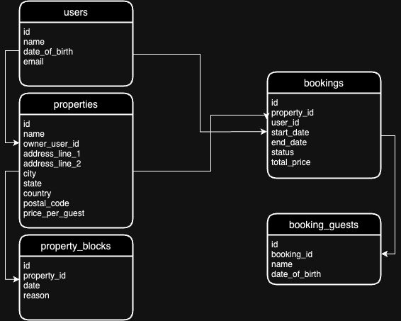

# Hostfully Technical Challenge

## Tech stack
* OpenJDK 17
* SpringBoot
* Gradle
* JUnit
* H2 DB

## Build & Run the project

### Prerequisites
-  JDK 17 and JDK_HOME set (you can run `brew install openjdk@17 ` on macOS)

After cloning the project, go to the project's root folder and run the following command:
```shell
./gradlew clean build assemble
```
This will run the tests, build & assemble the jar file.

After that, you can either run it directly in your machine by running:
```shell
./gradlew bootRun
```
Or you can use docker and run it inside a container:
```shell
docker build -t hostfully/technical-challenge:1.0 .
```
```shell
docker run hostfully/technical-challenge:1.0
```
**Note: If you're using a Apple Silicon processor (M1, M2 or M3 and any variants), you might need to add the following parameter `--platform=linux/amd64` to the docker commands above**

After the project is up and running, you can hit https://localhost:8080/ and you will be redirected to the Swagger UI with the API Portal.

## Project structure & architecture
The project follows a very simple architecture inspired by DDD.
It has two top-level packages: `common` and `service`:
- `common`:
  - The common package is the place to hold code that cannot fit in a single domain object, or code that is framework-specific or any global/reusable code in general.
- `service`:
  - This package is organized by subfolders representing the business domain objects (bookings, properties, users, etc).
  - Each subfolder is then organized into three other subfolders: `api`, `data` and `domain`.
  
- ### The `api` folder:
  - In this folder, you will find everything related to the REST API: The `request` and `response` objects (JSON representations of the domain objects), the API specification and the API implementation (Controller).
- ### The `data` folder
  - This is where you will find everything related to the data-access layer of the domain object. The entities definition as well as the Repository definition.
- ### The `domain` folder
  - This folder is responsible for holding the domain's business logic. This is where you will find DTO representations of the entities as well as domain service objects containing the business logic to manipulate the domain objects.

## Rest API Breakdown
All the available endpoints with descriptions, their payloads and possible responses are specified in the API portal (swagger). But here are some good-to-knows:

#### Monetary value representation
All the monetary values are represented in USD cents ($100 = 10000). This is a standard employed by many big names in the payments industry and makes it easier to store and deal with monetary values that doesn't need fractional cents representation.

#### API update endpoints
All the API update endpoints were implemented following the PUT specification. Meaning the updated resource will be replaced entirely by the incoming request body.
Partial updates are possible to implement through `PATCH` endpoints. To keep things simple I've decided to implement `PUT` only.

#### API response status code explanation:
- **2xx** - The request was processed successfully by the server.
- **400** - The request could not be understood by the server, usually a malformed request body (invalid json) is the cause.
- **422** - The request was understood by the server, but could not be processed because it didn't meet certain requirements imposed by the server. Ex.: The JSON body is valid but there is a required field that is blank or some business validation failed.
- **5xx** - Something unexpected happened with the server. This is usually worth a retry. 

## Solution implementation breakdown: 
The database model diagram:


Some assumptions/simplifications used to narrow down the solution scope a little bit:
- No authentication was implemented. And because of that, the `users` entity is quite simple as well.
- Since it was not specified to implement CRUD APIs for entities like `users`, `properties`, etc., even though I've implemented APIs for them, only basic validations were applied for these entities.
- Since the biggest focus wasn't on the `property` entity it was very simplified:
  - Only has `ownerUserId`, in a real world scenario an additional table would be needed in order to allow for more users to interact with the property through different roles (`OWNER`, `MANAGER`, `CONTRACTOR`, etc).
  - City, State and Country fields were not normalized and no validation was enforced.
  - A very simple pricing model based on the number of days and number of guests was implemented, in a real world scenario it would require a more robust pricing solution.
- The solution assumes properties are booked for the whole day and only deals with local dates, typically this would also include timestamps and timezone handling would be required in order to allow for multi-region functionality in a real world scenario. 
